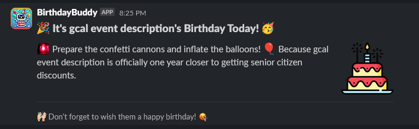
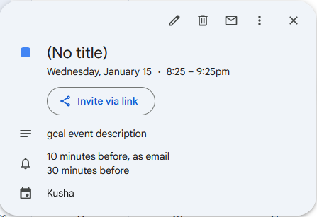
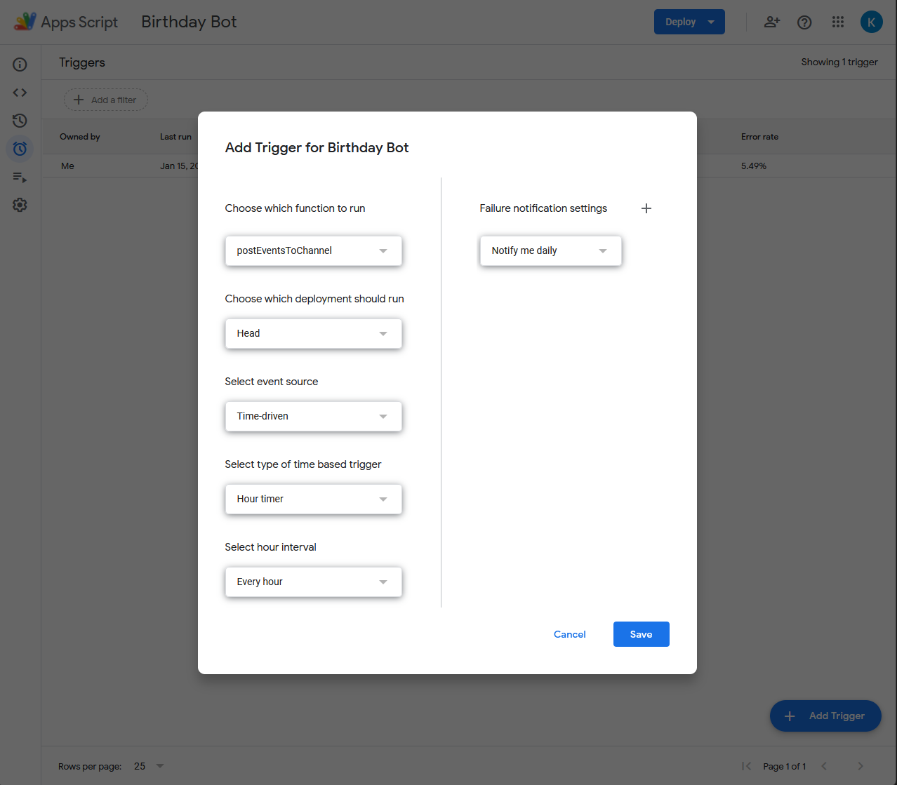

# GApp-Script-Slack-Birthday-Bot

## Google Apps Script that connects to your google calendar and sends a birthday message to slack

Your calendar event descriptions should be the person's name.

Copy and paste this script into a Google Cloud Apps Script project at https://script.google.com

You will need to replace  `WEBHOOK_URL` and `CALENDAR_ID` in the script with your [Slack Webhook URL](https://slack.com/marketplace/A0F7XDUAZ) and your Google Calendar's [Calendar ID](https://docs.simplecalendar.io/find-google-calendar-id/) respectively. You can also modify `minInAdvance` to change the amount of minutes ahead of time the events should show up. The default value should be 1 minute.

Then, you must enable Calendar API under Services on the left side of the Apps Script Page. Click the + button next to Services and look for Calendar API and enable it. v3 of the Calendar API should work fine.

You Will then need to setup a trigger to run the `postEventsToChannel` function every minute

You should see any events that will start within the next minute posted into an embed into the discord channel your webhook was on

